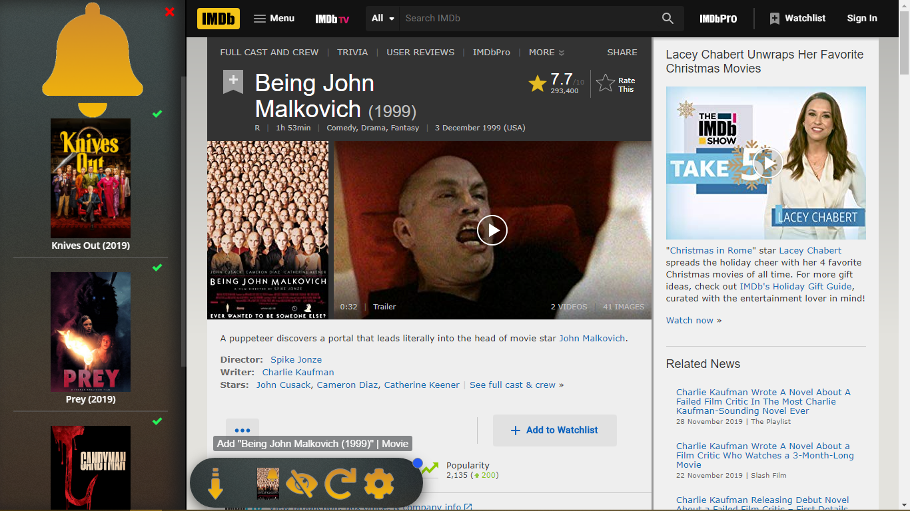

**We're currently in the process of making a v4 release which will contain the features listed below. The currently available version on the Chrome and Firefox webstore won't contain these features!**

# Web to Plex 

This browser extension searches your [Plex Media Server (PMS)](https://www.plex.tv/downloads/) for matching media on sites like [IMDb](https://imdb.com), letting you immediately open the movie or TV show in Plex, if it is available. If the item isn't found on your PMS, then a download button is added instead.

----

# NZB Managers

Optionally, you can configure NZB Manager (see support table) in the extension's options. After that, you can immediately add a TV show or movie with one click, right from your favorite site.

## Supported Managers
| Manager                                         | Movie Support | TV Show Support | Searchable
| ----------------------------------------------- |:-------------:|:---------------:|:----------:
| [Watcher 3](https://nosmokingbandit.github.io/) | ✔             | ❌             | ❌
| [CouchPotato](https://couchpota.to/)            | ✔             | ✔              | ❌
| [Radarr](https://radarr.video/)                 | ✔             | ❌             | ✔
| [Sonarr](https://sonarr.tv/)                    | ❌            | ✔              | ✔
| [Ombi](https://ombi.io/)                        | ❔             | ❔              | ✔
| [Medusa](https://pymedusa.com/)                 | ❌            | ✔              | ✔
| [Sick Beard](https://sickbeard.com/)            | ❌            | ✔              | ❌

### Key

| ✔ | ❌ | ❔ |
| - | - | - |
| yes | no | yes (with help) |

----

## Features
### Easy login
You can log into Plex using either an access token, your credentials, or Ombi (if setup).

### Download ()
On certain sites (denoted with the "download" icon), the user can choose to save/engage media directly, instead of waiting for their NZB manager to find the item.

### Plex It! ()
Click the icon to open **Plex It!** (left sidebar), click it again to add the current item(s) to your list.

It's primary purpose is to provide a watchlist service on sites that don't support watchlists.

### Hide Web to Plex ()
Use this to hide the **Web to Plex** button. It changes the button's opacity to 10% to make it almost invisible so that it isn't as distracting on sites like Netflix.

### Reload Web to Plex ()
Use this to reload **Web to Plex** on the current page. This can sometimes fix loading issues or cache errors.

### Plex URL
This is a *moderately advanced* setting, but is very useful to know. If you know your Plex server's URL (e.g. `https://localhost:32400`), then you can specify this and avoid bandwidth usage, as the extension will communicate with Plex on your device instead of `https://app.plex.tv/`.

### Find this | Right Click
If you aren't satisfied with a found item, or it is incorrect, you can right click the page and use the **Web to Plex | Find "XYZ"** feature to search for the item.

The sites used as search engines (IMDb, TMDb, and TVDb) will automatically create a cached version of the information (for "Local Search" results).

--------

## Supported sites

<article>

 <i>Sites</i> 

1.  [Movieo](http://movieo.me/)
2.  [IMDb](http://imdb.com/)
3.  [Trakt](https://trakt.tv/)
4.  [Letterboxd](https://letterboxd.com/)
5.  [GoStream](https://gostream.site/)1
6.  [TV Maze](http://www.tvmaze.com/)
7.  [The TVDb](https://www.thetvdb.com/)
8.  [The MovieDb](https://www.themoviedb.org/)
9.  [VRV](https://vrv.co/)2
10. [Hulu](https://hulu.com/)2/3/4
11. [Google Play Store](https://play.google.com/store/movies/)
12. Google Search (search results)
13. [iTunes](https://itunes.apple.com/)3/5
14. [Metacritic](http://www.metacritic.com/)4
15. [Fandango](https://www.fandango.com/)
16. [Amazon](https://www.amazon.com/)5
17. [Vudu](https://www.vudu.com/)
18. [Verizon](https://www.tv.verizon.com/)
19. [CouchPotato](http://couchpotato.life/)
20. [Rotten Tomatoes](https://www.rottentomatoes.com/)
21. [ShowRSS](https://showrss.info/)1 (button isn't meant to appear)
22. [Netflix](https://netflix.com/)3
23. [Toloka](https://toloka.to/)6
24. [Shana Project](https://www.shanaproject.com/)6
25. [My Anime List](https://myanimelist.com/)6
26. [My Shows](https://en.myshows.me/)6
27. [YouTube](https://youtube.com/)
28. [Flickmetrix (Cinesift)](https://flickmetrix.com/)
29. [Allociné](https://www.allocine.fr/)
30. [MovieMeter](https://www.moviemeter.nl/)
31. [JustWatch](https://justwatch.com/)
32. [Vumoo](https://vumoo.to/)1
33. [Web to Plex](https://ephellon.github.io/web.to.plex/)2/3/4/5
34. [Indomovie](https://indomovie.club)5/6
35. [Kitsu](https://kitsu.io/)6
36. [Redbox](https://redbox.com/)6
37. [Freeform (Go)](http://freeform.go.com/)6
38. [Free Movies Cinema](https://freemoviescinema.com/)6
39. [SnagFilms](https://snagfilms.com/)6
40. [Fox Searchlight](http://foxsearchlight.com/)6
41. [Verizon](https://tv.verizon.com/)5
42. [Tubi](https://tubitv.com/)
43. [Plex](https://app.plex.tv/)

**_Key_**

- `1` *This site uses the `Right click | Web to Plex | Save as...` feature (file download), or a direct link (usually magnet URL).*
- `2` *This site has a loading issue, simply refresh the page if the button doesn't appear.*
- `3` *This site doesn't allow media browsing, or requires a subscription beforehand.*
- `4` *This site is network intensive (loads slowly). Be patient.*
- `5` *This site is known to update frequently, support may change without notice.*
- `6` *This site is only supported via a plugin (enabled in the settings)*

</article>

## Installing Web to Plex

### Install the extension (Store)

### Install the source code (ZIP)

## Requirements

+ [**Plex Media Server v1.4.3.0**](https://www.plex.tv/downloads/#getdownload) or higher

+ Before using the [extension](chrome://extensions), you must configure the settings

## Issues & Contributions

<!--
    master:         83413
    beta-branch:    83438
-->

If you have any problem with the extension, please don't hesitate to [submit an issue](https://github.com/SpaceK33z/web-to-plex/issues/new/choose).

All contributions are welcome.

----

*Google Chrome is a trademark of Google Inc. Use of this trademark is subject to Google Permissions.*
*Firefox is a trademark of Mozilla Org. Use of this trademark is subject to Mozilla Permissions.*
*Safari is a trademark of Apple Inc. Use of this trademark is subject to Apple Permissions.*
*Edge is a trademark of Microsoft Inc. Use of this trademark is subject to Microsoft Permissions.*
*Plex is a trademark of Plex Inc. Use of this trademark is subject to Plex Permissions.*
