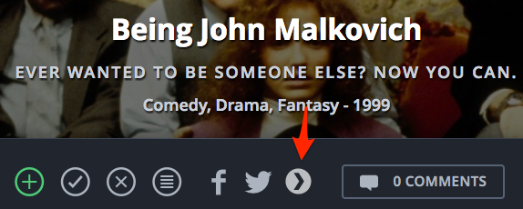

# Web to Plex

This browser extension adds a Plex button on movie pages like IMDb, letting you immediately open the movie or TV show on Plex Web if it is available.

Optionally you can configure CouchPotato or Radarr in the options. After that, you can immediately add a movie to CouchPotato/Radarr, with one click, right from your favorite movie page.

**Supported movie pages:**

 - [Movieo](http://movieo.me/)
 - [IMDb](http://imdb.com/)
 - [Trakt.tv](https://trakt.tv/)
 - [Letterboxd](https://letterboxd.com/)

## Install

**Download on [Chrome Webstore](https://chrome.google.com/webstore/detail/movieo-to-plex/kmcinnefmnkfnmnmijfmbiaflncfifcn).**

**Download on [FireFox Add-ons](https://addons.mozilla.org/en-US/firefox/addon/web-to-plex/).**

## Usage

Make sure you have at least **Plex Media Server v1.4.3** or higher.

Before using the extension, you need to configure it in the Options page (go to `chrome://extensions` and click on Options next to the extension).

If you have issues with configuring, please don't hesitate to [submit an issue](https://github.com/SpaceK33z/web-to-plex/issues/new).

## Contributions

All contributions are very welcome. Please make an issue first, so we can discuss it.

## Related

- [IMDb to Movieo](https://github.com/SpaceK33z/imdb-to-movieo)
